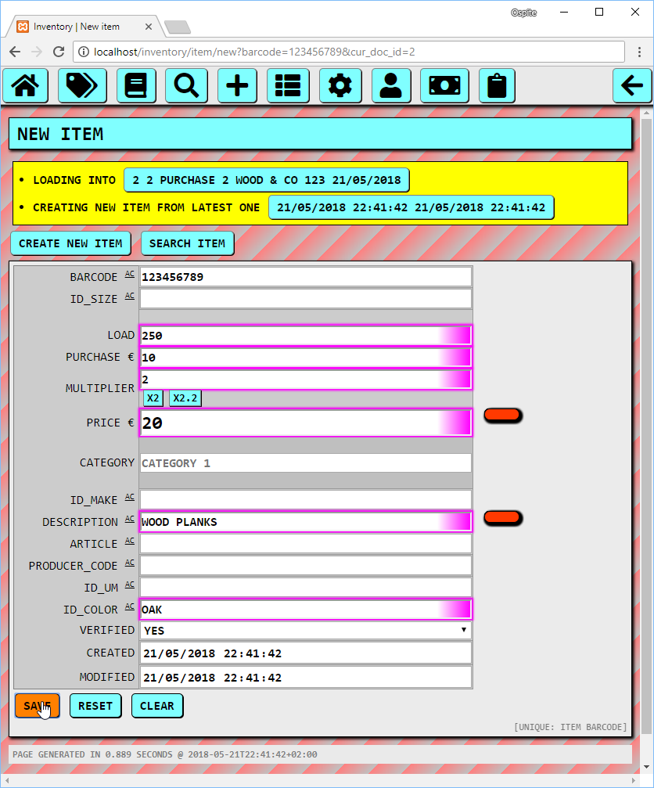
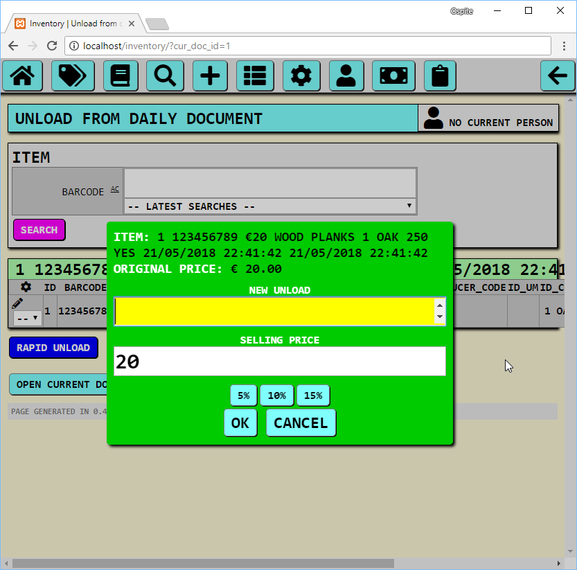
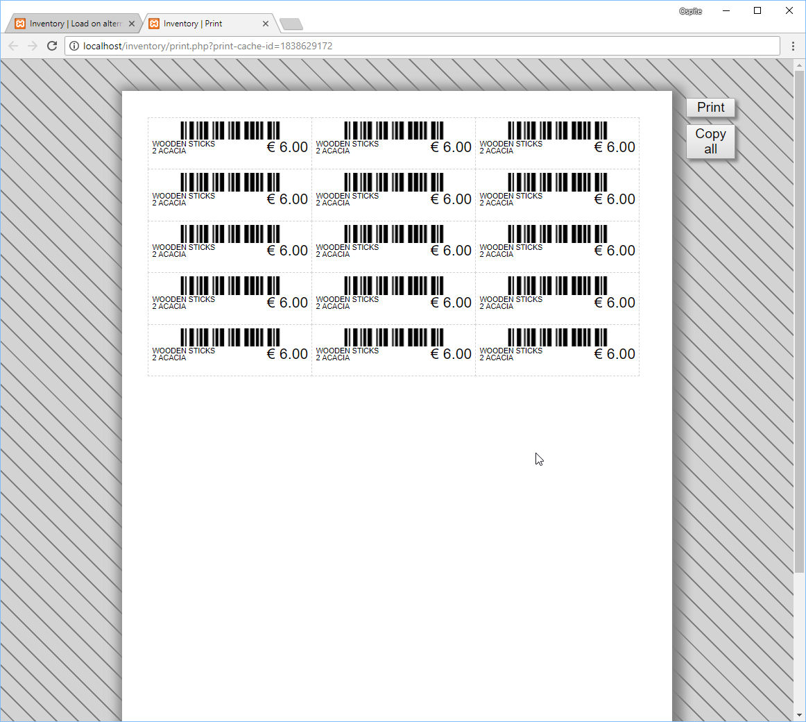

# Context

This software has been designed to run on a local Apache webserver. This code is almost guaranteed to have security flaws, so I strongly suggest you don't use it unless you're prepared to read and understand all of it and take responsibility to run it anywhere with important data inside. No guarantees given, you're on your own.

# Initial steps
The software expects a MySQL database to be created and accessible:

- create a "files" folder
- inside of the "files" folder create a "private" subfolder
- inside the "private" subfolder create a file named ".ht_pass.dat" and fill it with the database password (no newlines or spaces unless your passwords has them)

- in the file [config.php](app/config.php) do as follows:
	- in 'dbname' replace 'inventory' with the name of your database
	- in 'dbuser' replace 'inventory' with the user of your database
	- as you can see, 'dbpass' refers to the ".ht_pass.dat" file mentioned above; you can change its path here if you want to save that password elsewhere
	- in 'dbhost' replace 'localhost' depending on where your database engine is running
	- 'dbcharset' and 'dbcollate' would be better left as they are (and your database should match these)
	- in 'sitename' replace 'Inventory' with whatever site name you want to use (it will appear in the tab's titles)
	- in 'publicbase' rename '/inventory' public base according to your subfolder (for instance, if you'll be running it as "http://localhost/mycompany" change it to "/mycompany", replace it with "/" if you want to run it from the root
	- 'locale' would be a fallback for the translation system, you should not need it to test this system in English
	- 'localecode' should match whatever locale you decide to use for the translation system (naming the /locale/ subfolder accordingly), once more, leave it as it is for quickly checking out the English version
	- 'stockcompanyname' and 'dailydocumentname' may perhaps not make any sense to you right now, you can alter them after reading the following sections
	- 'stockcompanyid' gets used only to filter documents in a specific page, it would correctly match the number 1 if you're starting with an empty database, can be tweaked afterwards
	- 'fontfile' only gets used by the barcode generation code to print out errors in the generated images

The actual domain you'll be running the system on should make no difference, could be example.test, localhost, 127.0.0.1 or what have you. The system has no configuration for that.

- in the ".htaccess" file modify the "RewriteBase" rule according to what you did in the config file (so either replace it with "/" or "/mycompany" or whatever else)

Once you're done with all the above you should be able to start setting up the software from the browser (assuming your webserver and the mysql engine are running)

## Optional: get and install Gettext.js
I've coded on my own pretty much all of what you can see in this repository, here are a few exceptions with relative sources either in the attached files or in the comments of the files themselves.

All of the following "not invented here" things are included in the repository:
- parsedown.php [(see source)](lib/parsedown)
- uuid.class.php [(see source)](lib/uuid.class.php)
- OpenSans-Light.ttf, used only to render barcode errors [(see source)](res/fonts/opensans)
- FontAwesome icons [(see source)](res/fa)
- color.js [(see source)](js/color.js)
- filedrop-min.js [(see source)](js/filedrop-min.js)
- sprintf.js [(see source)](js/sprintf.js)

Due to the fact that the Gettext.js version I'm using is licensed under the GPLv2 and since I'm not sure whether it's okay for it to be distributed in my project I am not distributing it.

See [gettext.txt](js/lib/gettext/gettext.txt) for instructions about getting a copy of it and installing it yourself.

In any case Gettext.js only gets used by the client side JS code and it has a fallback to pass-through original strings in case such file isn't found, so you'll not really need it unless you want to localize all of this.

# First run

When first running the software you'll be presented with something like this:

The bunch of red errors are telling you that the database is empty, tables will be created in a short while.

Fill in the chosen username and type the chosen password twice (this is not about the database, this is the user that will access the software from the browser):

When you have filled in that data and hit "Send" you'll be presented with the login screen (continue ignoring the errors):

Fill in your username and password to login, you'll see those errors again, this time with the menubar on top:

It's still not time to use the system. Head to the "/schema" route altering the URL manually and execute the pending database fixes:

This should be the last time you see those errors, after this, the database tables and all records should be ready to be used:

This is the main page of the system: the daily unload. The whole system has been designed to be used in a retail shop, so the day-to-day business is to simply scan barcodes to find items in the inventory and record the amount of units sold.

Unfortunately the database is empty, so searching for barcodes isn't going to do any good:

Items should never be created from this page (which would tie them to the daily sales document, they should be tied to purchase documents instead) but the notice is there nonetheless. I think I'll remove that button sometimes but the current users of this system are cool with that so far (at least so I hope).

Instead, one should go to the "new document" page (in this case using the menu):

Which would lead to this form:

Problem is, we don't have any company on record, and no document type either. Let's go and check:

(yes, I know, the plural of "company" is "companies", and the plural of "category" is "categories", what you're seeing is actually the hardcoded and generated strings that would eventually get used by the translation system; I tried creating a new gettext .mo file for english but stumbled on some issues which weren't really worth fixing due to the rush I'm currently in, so I simply had the system dump out the source strings which are slightly odd but still pretty good for the purpose of using it)

The above menu leads to this page:

As it seems we *do* have a company. It's the default one (its name has been set in the config.php file). It's the "house company", so to say, which will have all the daily sales documents tied to.

Let's have a look at the doctypes as well:

The above menu leads to this page:

As it seems, we also have a default doctype, which is the "daily" one - again, this name has been set in the config.php file.

So let's suppose we want to create a "purchase" document from company "wood & co" to start creating all of our items. We may hit the "+" menu button and create them, but there's no real need to: the whole system is quite forgiving and will create them on the fly to save time - no, that could also lead to time losses and headaches if you misspell such names, but as above, this whole system has been created with specific requirements and the customer is fine with all of it as it seems).

So, simply fill in the company name and doctype as you better prefer, eventually fill in other fields, and save:

After saving you'll see how the system automatically created a new doctype and a new company using the data filled in the previous form. At the same time it switched the "current document" to be the purchase document we just created. To help the user tell the difference between the day-to-day normal interface (the one to record sales in the daily document) and the "alternate" situation (recording purchases and other types of documents) the background of the page turned to some weird diagonal red lines and the title reads "Load on alternate document":

In this "alternate" mode a search that doesn't match any existing barcode, such as the following:

Will automatically lead to the creation of a new item:

(the line reading "creating new item from the latest one isn't really meaningful in this case, because this is the very first item we're creating)

So, here above you can specify how many units are being added to the system (load), how much each unit is being paid for (purchase), and you can also use multiplier shortcuts to compute the selling price (price) according to the purchase price. Such multipliers can be configured (both generic ones and per-company ones).

Once you save you'll be sent to the home page (which is still in alternate mode), with a confirmation about the saving itself:

In the above page you can click on "Open current document and changes" to see what actually ties the item you just created to the document you created earlier: the "change" record:

I couldn't come up with any better name, so the "change" records in this system are the ones that tell you how many units of a specific item you have bought or sold, for what price and what document owns them. All the strings of this interface, as mentioned above, can be tweaked with a translation file - in fact this normally runs in italian:

Anyway, since we now have an item to be sold, we can go back to the daily document, clicking on the highlighted button here below:

Which will lead to the normal day-to-day interface:

Into which we can type / scan the required barcode:

Which will in turn pop out the unloading/sales dialog:

The amount to be sold (new unload) gets focused automatically, allowing for typing the amount straight away:

The "10%" button hovered in the previous screenshots applies such discount to the selling price (20 becomes 18):

And at that point one only has to click on "OK" (or hit ENTER on the keyboard, cause the focus shifts onto the next element automatically) which will show the sale's confirmation:

Finally, you can notice how the last searched for item stays on screen (the one with the pale green heading reading "wood planks") and how its stock amount has been decreased from 250 to 248 after selling the two units (and you can review the daily operations in the "List changes" section below, which will grow as you proceed with sales through the day):

# Anything else?

Sure, there are a lot of other features in this system, I won't list them all, only a few that tickled my mind while creating this recap.

## Settings and labels

From the settings page (accessible using the "cog" button in the menu) you can tweak lots of options (for instance how "verbose" the interface itself is, you can decide to show or hide pretty much any field of any record in different contexts).

Here is the settings section that allows templating the labels to be printed (for those items that don't have a label at all, of those that have a misprinted one that can't be scanned and so forth):

From the edit page of each item such labels can be printed in an arbitrary amount, but they can also be batch-printed from a purchase document as well, here we're about to print labels only for the selected record, and 15 labels will be prepared (cause 15 units have been registered as purchased in this document):

The page for printing will appear in a new tab but your browser may block it, keep an eye on your URL box for an error message or something like that. If the popup doesn't get blocked (or you tell it to show it after being blocked) you should see something like this:

The above is a "pre-preview", so to say. It's just a regular HTML page but you can edit anything in the white section; once you're happy with any edit you can print or copy it (the copy feature is useful for other types of prints, for instance the "email" print which is nothing more than a different print template which will require you to actually open your mail client and paste in there the contents of your message; these alternate print templates, again, reflect my customer requirements who performs purchases in various ways, including email, fax or plain paper printouts for purchasing in person at wholesale resellers.

## Custom colors

Pretty much all the interface colors can be customized live, it's enough to hover on a particular spot and hit F7 on the keyboard, something like this will appear:

Such changes get applied immediately (eventually clearing the cache, depending on how the system has been set up) and get stored in the current theme. Different themes can be created and switched from the "cog > theme" menu.

## Managing customer's balances

Each change record can be tied to a person; doing so will record such sale as a debt for such person:

Such bound can be seen in the sale document's listing:

Arbitrary payments can be recorded for such customers:

The edit/view pages for each person give access to their balance and their purchases / payments history:

The system allows for creating customer cards with custom barcodes, but a person must be assigned a customer number first. In this case we're setting customer number "42" for Jane Doe:

We also need a card template, if we want to print them:

And we can print such cards from the persons' list:

Here is a card with the above template:

Once the customer number is assigned persons can be activated in the homepage by scanning their barcode or by entering their customer number manually:

Which leads to their name getting highlighted in the top-right corner of the page:

Hovering such name permits a quick access to the balance overview where you can also create a quick payment or deactivate the current person; only partially or completely unpaid items are listed here, all paid items purchased in the past aren't listed here:

During the time a person is active in this main page, any sale performed will be tied to that person and the sale's dialog will take in account various other things such as a default discount to be applied:

## Keeping track of customer requests

The system allows to keep track of requests regardless of the person being a regular customer or an occasional one:

Person records get created on the fly just like any other record, in this case in fact also the "random shop name" company will be created on the fly, the creation of those two additional records can be seen in the confirmation shown by the next screenshot which also shows the list of all open requests:

In the above screenshot we're about to print out the list of pending requests, which will lead to something like this:

# Nothing else? Really?

Oh, no, that's not all there is to it.

The system has lots of other features, such as applying discounts automatically depending on categories, creating end-of-year stock reports, on-the-fly stock corrections by clicking on the green stock quantities, closing requests with a single click from the requests' list, extensive search facilities for each record, batch editing of multiple records, paged listings, forbidding certain operations in certain scenarios, customizing quick buttons to be displayed in each record listing, attaching images to requests and to items (including capturing them on the fly from a webcam or dragging files onto the relative page), backup and restore of the database, a logging system to keep track of all actions (in particular of batch edits) to help manually fixing bad user (or software) mistakes and so on.

I'll eventually continue fixing bugs and documenting this "thing" here and there in the future. For now, the purpose of having all of this barely working and somewhat illustrated is more than fulfilled.
